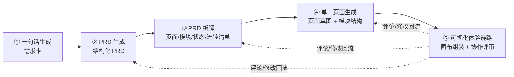
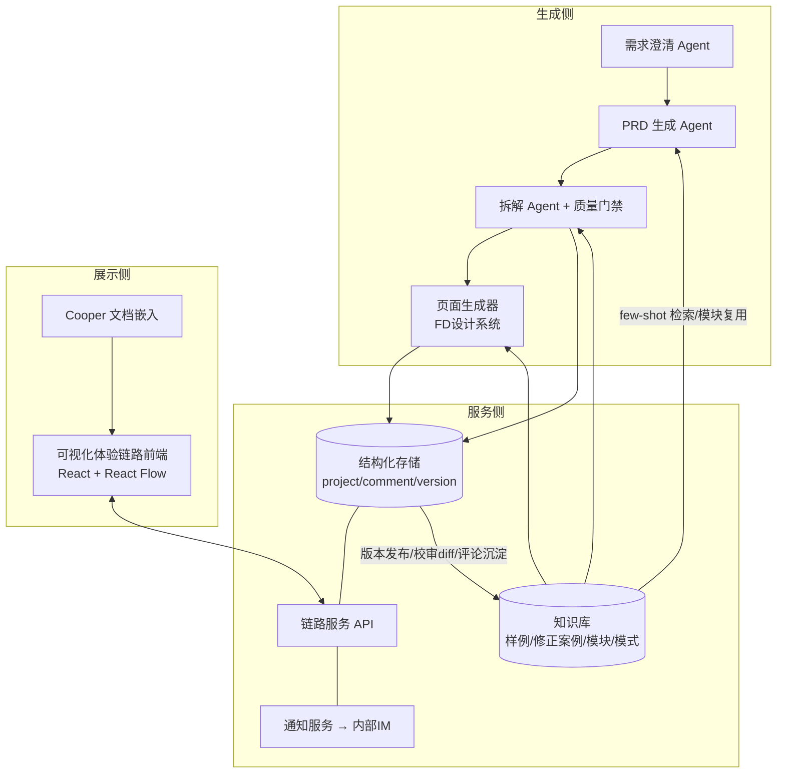

# 从一句话到可视化体验链路 —— 设计智能生产管线项目方案

| 文档信息 | |
| --- | --- |
| 文档状态 | 草案 V0.1（待评审） |
| 作者 | 交互体验设计 |
| 创建日期 | 2026-08-04 |
| 评审人 | 待定（PM / 设计 / 开发 / 测试代表） |
| 关联资产 | 可视化体验链路 Demo：https://lmqinsydney-lab.github.io/UX-Process-Map/ · 仓库：https://github.com/lmqinsydney-lab/UX-Process-Map |

---

## 一、背景

### 1.1 现状与痛点

当前一个需求从想法到可评审的交互产出，链路是割裂的：

| 环节 | 现状 | 痛点 |
| --- | --- | --- |
| 需求表达 | PM 口头 / 文档碎片描述 | 需求边界模糊，设计反复对齐 |
| PRD 撰写 | 文档工具（Cooper 等）手写 | 结构不统一，页面/状态/异常流常有遗漏 |
| 交互设计 | Figma 手绘页面流程大图 | 产出慢；页面、状态、模块的隐性逻辑埋在标注文字里 |
| 评审协作 | 截图贴文档、会议口头评论 | 评论散落在 IM / 文档 / 会议纪要，无法锚定到具体页面与模块；改动后各方信息不同步 |
| 走查验收 | 测试/开发对照静态大图 | 状态枚举、流转条件靠人肉比对，易漏 |

核心问题：**设计交付物是"静态图"，而需求本质是"结构化的页面-模块-状态-流转"**。结构没有被显性化，导致每个环节都在重复解读和转译。

### 1.2 已有基础

1. **可视化体验链路 Demo 已跑通**（本仓库）：无限画布流程全览、页面聚焦、模块热区/聚光灯、页面-模块-状态-流转的结构化数据模型（`project.json`）、线上参考对比、对话编辑占位。形态已经过多轮真实项目数据（月付-分期还款）打磨。
2. **AI 生成能力资产已沉淀**（Claude skills）：
   - `ux-prd-analyzer`：月付类产品 PRD 的 UX 梳理（流程/页面/状态枚举/线框描述）；
   - `didifd-design-system`：滴滴 FD 设计规范的 UI 草图 / HTML 原型生成；
   - `competitive-design-system`：月付类竞品设计参考库（花呗/抖音月付/美团月付等）。
3. **结构化数据规范已验证**：流程节点 → 页面 → 状态 / 模块（含状态枚举、展示条件、点击流转）→ 连线（事件/条件/类型）的四层模型，可同时驱动画布渲染与协作锚点。

---

## 二、项目目标

### 2.1 目标

> **一句话需求进，可交互的可视化体验链路出**；全程结构化、可追溯，PM / 设计 / 开发 / 测试可以随时在链路上修改与评论。

分解为两条主线：

1. **生产提效线**：一句话 → PRD → PRD 拆解 → 单页生成 → 体验链路，五级流水线全部 AI 辅助生成 + 人工校审，设计师从"画图者"转变为"决策与校审者"。目标：需求到可评审链路草稿 ≤ 1 天（现状约 3~5 天）。
2. **协作保障线**：体验链路成为四角色的**单一事实源（Single Source of Truth）**——评论锚定到页面/模块/连线/状态粒度，修改有版本与通知，评审、走查、验收都在同一载体上进行。

### 2.2 非目标（本期不做）

- 视觉高保真稿生成（生图能力预留接口，后续接入）；
- 替代 PRD 的法定文档地位（本期与 Cooper 文档互链共存）；
- 自动生成前端生产代码；
- 多项目空间 / 权限体系的完整中台化（试点期用轻量角色控制）。

---

## 三、整体方案

### 3.1 五级流水线



每一级都遵循同一原则：**AI 生成草稿 → 人工校审确认 → 结构化落库**。上一级的输出是下一级的输入，全链路共享一套数据主线。

### 3.2 各阶段输入 / 输出物

| 阶段 | 输入 | AI 做什么 | 人做什么 | 输出物 |
| --- | --- | --- | --- | --- |
| ① 一句话生成 | 一句话需求 + 追问回答 | 澄清式追问（目标用户/场景/成功指标/边界），补全成需求卡 | 回答追问、确认需求卡 | 结构化需求卡（背景/目标/范围/约束/指标） |
| ② PRD 生成 | 需求卡 + 竞品参考库 | 按模板生成 PRD：业务流程、功能清单、页面初稿、异常与边界、埋点 | 校审补充业务规则、拍板范围 | 结构化 PRD（含可拆解标记） |
| ③ PRD 拆解 | 结构化 PRD | 拆出流程节点/页面/模块/状态/流转边清单；标注触发组件与判断条件；推断处打 TODO | 校对清单、确认合并/拆分、补条件 | 链路数据骨架（project.json 草稿） |
| ④ 单一页面生成 | 链路数据骨架 + 设计系统 | 按滴滴 FD 规范逐页生成草图（HTML/图片），模块区块与数据骨架一一对齐 | 校审页面结构、调整模块划分 | 页面草图集 + 模块热区坐标 |
| ⑤ 可视化体验链路 | 骨架 + 草图集 | 自动组装画布：分组/连线/聚合/状态托盘 | 评审、评论、修改、发布 | 可交互体验链路（分享链接） |

### 3.3 数据主线：一份结构化数据贯穿全程

五个阶段共同读写同一份结构化数据（现有 `project.json` 模型的扩展），这是"随时修改、评论"的基础：

```
需求卡 requirement
└─ PRD prd（章节树，功能点带 traceId）
   └─ 体验链路 project
      ├─ processNodes[]   流程节点（分组）
      ├─ pages[]          页面（desc / onlineCompare / traceId → PRD 功能点）
      │   ├─ states[]     页面状态（截图/草图、moduleStates 组合）
      │   └─ moduleInstances[]  模块实例（热区、visibleWhen、clickEdgeId、traceId）
      ├─ modules[]        模块定义（跨页复用、状态枚举）
      ├─ edges[]          流转边（触发组件事件 / 判断条件 / 类型：主流程・分支・异常・反向）
      ├─ comments[]       评论（见 §5.2）
      └─ versions[]       版本快照（见 §5.3）
```

关键设计：
- **traceId 溯源**：每个页面/模块/边都携带来源 PRD 功能点 id，评审时可一键回看"这个模块对应哪条需求"，需求变更时可反向定位受影响的页面。
- **建模规约**（已在 Demo 中验证并固化）：
  - 流转触发必须落在可交互组件（按钮/列表项/tab），装饰元素（气泡/角标）只作引导展示；
  - 骨架相同、仅条件差异的多张页面图合并为"一页多状态"，差异模块标 `visibleWhen`；
  - 图上未标注的流转不得编造，推断必须打 `TODO(待确认)` 标记。

### 3.4 知识沉淀与复用（生成飞轮）

每一次生成的产物**自动存入知识库**，为后续的生图（页面生成）与生链路（骨架拆解/组装）持续储备领域知识——用得越多，生成越准。

**沉淀什么（四类知识资产）：**

| 资产类型 | 内容 | 来源 | 反哺谁 |
| --- | --- | --- | --- |
| 样例库（few-shot） | 按业务线归档的「需求卡 → PRD → 骨架 → 草图 → 链路终稿」全链路成对样本 | 每次发布版本时自动抽取（版本快照即样本） | 阶段②③生成 |
| 修正案例库 | AI 草稿 vs 人工校审确认稿的字段级 diff（**最有价值的监督信号**：设计为什么改、怎么改） | 校审动作自动记录 | 阶段②③④的生成约束与自检 |
| 模块 / 组件库 | 全局模块定义的跨项目积累：名称、状态枚举、展示条件模式、热区版式、FD 视觉映射（如"金额展示""期数选择"） | 阶段③④产物去重入库 | 阶段④生图（结构直接复用）、阶段③拆解（命名与状态枚举对齐） |
| 模式与规约库 | 流程模式（入口引导→操作→结果→记录）、状态维度模式（收起/展开 × 优惠使用中/待使用）、建模规约、评论中沉淀的领域规则（如置灰规则） | 评论解决时一键"沉淀为知识"；规约由评审反馈固化 | 全阶段的生成提示词与质量门禁 |

**回流机制（何时入库）：**
1. **版本发布即入库**：设计发布里程碑版本时，全链路产物 + traceId 关系自动归档为一条完整样本；
2. **校审即标注**：每次人工修改 AI 草稿，diff 自动生成修正案例（改前/改后/所属阶段/元素类型），零额外操作；
3. **评论即沉淀**：评论解决时若产生可复用的业务规则，解决人一键标记"沉淀为知识"，挂到对应模块/模式条目下。

**使用机制（何时取用）：**
- 阶段②③④生成时自动检索知识库，**同业务线样本优先**作为 few-shot 上下文；
- 阶段③拆解命中模块库时直接复用既有模块定义（含状态枚举），保证跨项目命名与结构一致；
- 阶段④生图命中模块版式时复用热区布局，只做内容级变化；
- 质量门禁引用修正案例库做生成自检（"上次同类拆解设计改了什么"）。

**冷启动**：以本 Demo 的月付-分期还款全量数据作为第一条种子样本；`ux-prd-analyzer` / `competitive-design-system` 中已固化的月付领域知识同步登记为模式库初始条目。

---

## 四、分阶段详细设计

### 4.1 阶段①：一句话生成（需求澄清）

- **交互形态**：对话式。用户输入一句话（如"月付还款页增加分期优惠引导"），Agent 按固定澄清框架追问 3~5 个问题：目标用户与场景 / 期望行为变化 / 成功指标 / 范围边界（哪些页面涉及）/ 已知约束。
- **输出**：需求卡。字段：背景、目标（可量化）、用户故事、范围（涉及页面初判）、约束、验收标准、开放问题。
- **校审点**：PM 确认需求卡后才进入阶段②；开放问题未清零的字段在后续阶段自动带 TODO 标记。

### 4.2 阶段②：PRD 生成

- **能力复用**：`ux-prd-analyzer`（月付类 PRD 的 UX 梳理框架）+ `competitive-design-system`（竞品同类功能的设计参考，生成"竞品做法"附录）。
- **PRD 模板章节**：需求背景 / 目标与指标 / 业务流程图 / 功能需求清单（每条带 traceId）/ 页面与状态初稿 / 异常与边界场景 / 数据埋点 / 灰度与回滚。
- **结构化要求**：功能需求清单每条必须落到「页面 + 模块 + 行为 + 条件」的四元组描述，这是阶段③可机器拆解的前提。
- **校审点**：PM 补充业务规则（利率、费用、风控等 AI 不可杜撰的域知识），拍板范围。

### 4.3 阶段③：PRD 拆解

- **拆解规则**：按数据主线模型输出链路骨架。要点：
  - 页面归组到流程节点，主流程从左到右；
  - 状态维度化：识别"同页多状态"（条件差异）与"模块状态维度"（如期数收起/展开 × 优惠使用中/待使用），避免状态组合爆炸式平铺；
  - 每条边必须有：触发组件、事件、判断条件、类型（主流程/分支/异常/反向）；PRD 未写明的推断统一打 `TODO(待确认)`；
  - 模块全局去重：跨页复用的模块只定义一次，页面引用实例。
- **校审点**：设计师在清单视图逐项确认（支持批量通过），确认后的骨架冻结为 V0。
- **质量门禁**：自动校验（引用完整性 / 状态覆盖 / 孤立页面 / 无触发组件的边），校验不过不能进入阶段④——复用现有 `validate-data` 脚本扩展。

### 4.4 阶段④：单一页面生成

- **能力复用**：`didifd-design-system` 按滴滴 FD 规范生成每个「页面×状态」的草图（HTML 渲染为图，或直接 HTML 嵌入）；模块区块与骨架中的 moduleInstances 一一对应，**热区坐标由生成器直接输出**（不再人工标注）。
- **三种素材形态自动降级**：高保真草图（默认）→ 线框占位（快速模式）→ 真实截图（改版类需求，用现有裁切管线导入线上截图作对照 `onlineCompare`）。
- **校审点**：设计师逐页校审草图与模块划分；不满意的页面可对话式重生成（"金额展示模块加上账期说明"），重生成只影响该页面，不动骨架。
- **生图预留**：视觉风格化生成（接生图模型）作为后续增强，接口预留在素材管线层。

### 4.5 阶段⑤：可视化体验链路（组装与协作）

- **底座**：现有 Demo 升级为产品化应用（React + React Flow）。已具备：全览/聚焦、模块聚光灯、状态托盘、跨流程聚合连线、双击沿流转跳页、线上参考对比、面板-画布双向 hover 联动。
- **本期新增**：
  1. 数据从静态 JSON 切到服务端存储（阶段③④的产出自动落库、实时加载）；
  2. 评论体系与版本机制（见第五章）；
  3. 对话编辑从占位变为真实能力：面板中对页面说明/模块说明/条件文案的自然语言修改直接落库并广播；
  4. 分享与嵌入：链路链接可嵌入 Cooper 文档，评审会直接投屏操作。

---

## 五、协作机制（随时修改、评论）

### 5.1 角色与权限矩阵

| 能力 | PM | 设计 | 开发 | 测试 |
| --- | --- | --- | --- | --- |
| 浏览 / 分享 | ✓ | ✓ | ✓ | ✓ |
| 评论 / @成员 / 解决评论 | ✓ | ✓ | ✓ | ✓ |
| 修改文案类字段（说明/条件） | ✓ | ✓ | 提议 | 提议 |
| 修改结构（页面/模块/边/状态） | 提议 | ✓ | 提议 | 提议 |
| 发布版本 / 回滚 | — | ✓ | — | — |
| 触发重新生成（阶段②~④） | ✓ | ✓ | — | — |

"提议"= 修改以待确认状态挂起，设计师确认后生效（结构是设计的职责边界）。

### 5.2 评论体系

- **四级锚点**：评论可锚定到 流程节点 / 页面（含具体状态）/ 模块实例 / 流转边。画布上锚点处显示评论气标，聚焦态面板内联展开评论串。
- **评论属性**：正文、@成员、附图、分类标签（疑问/缺陷/建议/阻塞）、状态（待处理/已解决/搁置）、解决人与时间。
- **典型场景**：
  - 测试在「优惠待使用-期数收起」状态上评论"待使用标签的置灰规则 PRD 没写"→ @PM → PM 补充条件 → 设计确认 → 评论自动关联该次修改并置为已解决；
  - 开发对某条边评论"这个条件端上拿不到，需要服务端下发"→ 转为 PRD 回流修改。
- **通知**：@提及与状态变更推送内部 IM；每日未解决评论摘要推送项目群。

### 5.3 修改与版本

- **结构化 diff**：所有修改记录为字段级变更（谁、何时、改了哪个页面/模块/边的哪个字段、前后值），画布支持"对比模式"高亮两版本差异（新增页面描蓝、删除描红、字段变更黄点）。
- **版本快照**：设计师手动发布里程碑版本（评审版 V1、终稿 V2…），任意版本可回滚、可并排对比。
- **上游回流**：链路上的修改若触及需求范围（新增页面/砍掉流程），自动标记对应 PRD 功能点为"已偏移"，提醒 PM 同步文档，保持 traceId 链路一致。

---

## 六、技术方案

### 6.1 架构



- **前端**：沿用现有仓库底座（React 18 + React Flow 12 + Vite），已含画布/聚焦/热区/聚合连线全部能力；
- **生成侧**：基于 Claude 的 Agent 编排，复用三个现有 skill；拆解产物必须过 schema 校验 + 质量门禁；
- **服务侧**：试点期最小实现——结构化 JSON 存储 + WebSocket 广播（评论与修改实时同步）+ IM 通知 webhook；
- **部署**：内网部署（当前 GitHub Pages 为外部 Demo，产品化后迁内网，权限走内部 SSO）。

### 6.2 数据模型扩展（相对现有 schema）

```jsonc
// 新增
"comments": [{
  "id": "c1",
  "anchor": { "type": "module", "pageId": "repay-page", "moduleId": "installment-coupon", "stateId": "collapsed" },
  "author": "user_id", "body": "置灰规则待确认", "tag": "疑问",
  "mentions": ["pm_id"], "status": "open",
  "resolvedBy": null, "createdAt": "...", "replies": [ ... ]
}],
"versions": [{ "id": "v1", "name": "评审版", "publishedBy": "...", "at": "...", "snapshotRef": "..." }],
// pages[] / moduleInstances[] / edges[] 增加
"traceId": "prd-func-012"   // 溯源到 PRD 功能点
```

---

## 七、里程碑

| 里程碑 | 内容 | 出口标准 | 周期（估） |
| --- | --- | --- | --- |
| M0（已完成） | 可视化体验链路 Demo | 真实项目数据跑通全部浏览交互，分享链接可用 | 已交付 |
| M1 | 协作最小闭环 | 数据落库 + 四级锚点评论 + IM 通知；试点项目团队真实使用评审一次 | 2 周 |
| M2 | 修改与版本 | 文案类字段在线修改、结构修改提议流、版本快照与对比 | 3 周 |
| M3 | 生成管线接入 + 知识库自动回流 | 阶段①~④串通：一句话进 → 链路骨架+草图自动产出，设计校审后组装；版本发布/校审 diff 自动入库，生成侧接通知识检索 | 4 周 |
| M4 | 试点验收与推广 | 1~2 个真实需求全流程走完；产出时效与协作指标达标；知识库沉淀 ≥ 2 条全链路样本 + 首批模块库条目；沉淀使用手册 | 2 周 |

### 7.1 试点计划

选取月付业务 1 个中等规模需求（涉及 8~15 个页面）做全流程试点：PM 从一句话开始，设计校审各级产出，开发测试全程在链路上评论走查。试点期间双轨（Figma 交付照旧），验收达标后逐步切换。

---

## 八、风险与对策

| 风险 | 影响 | 对策 |
| --- | --- | --- |
| AI 拆解/生成不准，校审成本高于收益 | 提效目标落空 | 质量门禁前置；建模规约固化为生成约束；按业务线沉淀 few-shot 样例库（月付先行） |
| AI 编造 PRD 未写明的流转/规则 | 评审误导，返工 | 强制 TODO 标记规约（已固化）；校审清单把 TODO 项置顶必审 |
| 页面草图与真实视觉差距大，评审方不接受 | 工具被弃用 | 定位讲清楚："结构评审载体"而非视觉稿；改版类需求导入线上截图对照；生图增强排后续 |
| 多人同时修改冲突 | 数据覆盖 | 字段级修改 + 提议流；结构修改单人（设计）收敛；WebSocket 实时同步 |
| 内网部署与权限合规 | 上线阻塞 | M1 前完成内网部署评估；试点期数据仅限项目组可见 |
| 域知识（利率/风控规则）AI 不可靠 | PRD 错误 | 此类字段模板中标记为"人工必填"，AI 只留占位 |

---

## 九、衡量指标

| 指标 | 现状基线 | 目标 |
| --- | --- | --- |
| 需求 → 可评审链路草稿时效 | 3~5 天 | ≤ 1 天 |
| 页面/状态/异常流遗漏数（评审后追加数） | 按试点前需求统计 | 下降 50% |
| 评论解决时长（中位数） | 无载体，不可测 | ≤ 24h |
| 评审会后信息同步返工次数 | 按试点前需求统计 | 下降 50% |
| 知识复用率（生成时命中知识库样例/模块的比例） | 0（冷启动） | 第 2 个试点需求起 ≥ 40% |
| 校审修改率（AI 草稿被人工修改的字段占比，衡量生成质量走势） | 试点首需求作基线 | 随知识库积累逐需求下降 |
| 四角色 NPS（试点问卷） | — | ≥ +30 |

---

## 十、附录

### 10.1 名词表

| 名词 | 定义 |
| --- | --- |
| 流程节点 | 画布上的分组容器，代表流程阶段（如"入口""还款流程"），流程间连线聚合为单箭头 |
| 页面状态 | 同一页面在不同条件/交互下的形态，一状态一张图；骨架相同仅条件差异的图合并为一页多状态 |
| 模块 | 页面内的功能区块，全局定义、页面实例化；有状态枚举、展示条件（visibleWhen）、点击流转（clickEdgeId） |
| 流转边 | 页面（可精确到状态）之间的跳转：触发组件事件 + 判断条件 + 类型（主流程/分支/异常/反向） |
| traceId | 链路元素回溯到 PRD 功能点的溯源标识 |
| 聚光灯 | 聚焦态下选中模块时，页面其余区域加暗色蒙层、仅选中模块镂空的高亮方式 |
| 修正案例 | AI 生成草稿与人工校审确认稿之间的字段级 diff，作为后续生成的监督样本 |
| 知识复用率 | 一次生成中命中知识库既有样例/模块/模式的元素占比 |

### 10.2 参考

- 可视化体验链路 Demo：https://lmqinsydney-lab.github.io/UX-Process-Map/
- 仓库与数据规范：https://github.com/lmqinsydney-lab/UX-Process-Map （`src/data/project.json`、`docs/superpowers/specs/`）
- 建模规约来源：Demo 迭代过程中与设计确认的三条规约（触发组件规约 / 同页多状态合并规约 / TODO 标记规约）
